# Smiling Depression
## Project Portfolio 1 of Diploma in Full Stack Software Development at Code Institute

[View the live site](https://tomdu3.github.io/CI-project-1/)

## Table of contents
1. [Site Info](#site-info)
2. [UX](#ux)
    1. [Ideal User Demographic](#ideal-user-demographic)
    2. [User Stories](#user-stories)
    3. [Development Planes](#development-planes)
    4. [Design](#design)
3. [Features](#features)
    1. [Existing Features](#existing-features)
    2. [Features to Implement](#features-to-implement)
4. [Issues and Bugs](#issues-and-bugs)
5. [Technologies Used](#technologies-used)
     1. [Main Languages Used](#main-languages-used)
     3. [Frameworks, Libraries & Programs Used](#frameworks,-libraries-&-programs-used)
6. [Testing](#testing)
7. [Deployment](#deployment)
8. [Credits](#credits)
     1. [Content](#content)
     2. [Code Features](#code-features)
     3. [Media](#media)
9. [Acknowledgements](#acknowledgements)

## Site Info

This website has as a main theme the **smiling depression**, a functioning depression condition that is quite spread and many times unobserved. Here the developer wanted to give a first information about this condition and raise awareness about it. The general info is then linked to the fictious Institute of Wellbeing in Rome from which a person can require help or more info.

This website was made for the first of five Milestone projects required to complete the Diploma in Software development program at The Code Institute. 

The main requirements of this project are to build a responsive and static front-end site to present useful information to users using all the technologies learned so far, namely HTML5 and CSS3. The site is to contain no less than three pages.

[Back to top ⇧](#smiling-depression)

## UX
### Ideal User Demographic
The ideal user for this website is:
* Current user
* New user
* Person suffering of smiling depression
* Person working/living with someone suffering of smiling depression

### User-Stories
#### Current User Goals
As a current user:
1. I want to find general information about smiling depression and its symptoms.
2. I want to easily navigate through the site and access the information I require.
3. I want to easily navigate to content I have previously viewed within a small number of steps.
4. As a current user, I want to easily find the info and contact form for the Institute for Wellbeing.

#### New User Goals
As a new user:
1. I want to easily navigate the entire site intuitively. 
2. I want the information I seek to be easily accessible and relevant.
3. I want attractive and relevant visuals and colour schemes that work with the content.
4. I want to easily find the info and contact form for the Institute for Wellbeing.

#### Goals of a Person Suffering of Smiling Depression
As someone who suffers of smiling depression:
1. I want to factually correct and relevant information about smiling depression and its symptoms.
2. I want the information I seek to be easily accessible and relevant.
3. I want to easily be able to find info about the Institute for Wellbeing and make contact.

#### Goals of a Person working/living with someone suffering of smiling depression
As someone who is working/living with a depressed person:
1. I want to factually correct and relevant information about smiling depression and its symptoms.
2. I want the information I seek to be easily accessible and relevant.
3. I want to easily be able to find info about the Institute for Wellbeing and make contact on behalf of the person suffering of smiling depression.

### Development Planes
In order to provide a website that responds to the above mentioned user stories with the corresponding functionalities, the developer must present the smiling depression as a serious condition, the symptoms, the testimonials of this condition and give the opportunity for the user to require more info or help in that regard.

#### Strategy
Strategy incorporates user needs as well as product objectives. This website will focus on the following target audience, divided into three main categories:
- **Roles:**
    - Current users
    - New users
    - Person suffering of smiling depression
    - Person working/living with someone suffering of smiling depression

- **Demographic:**
    - All ages
    - People working in professional environment
    - People exposed to stress at work

- **Psychographic:**
    - Lifestyles:
        - Professionals working with other people
    - Personality/Attitudes:
        - Ingoing
        - Focused
        - Creative
        - Overworking
    - Values:
        - Wellbeing of a person
        - Care for someone in difficulty

The website needs to enable the **user** to:
- Retrieve the desired information about:
    - General info about smiling depression
    - Symptoms of smiling depression
    - Videos & Testimonials about smiling depression
    - Contact and Form to get in touch with the Institute for Wellbeing
    
The website needs to enable the **site manager** to:
- Gather the contact details of the site visitors in order to contact them.

#### Scope
The scope plane is about defining requirements based on the goals established on the strategy plane. Using the information in the strategy plane, the identified required features have been broken into the following two categories.
- Content Requirements:
    - The user will be looking for:
        - General information about smiling depression
        - 4 symptoms of smiling depression
        - Testimonial about personal experience of smiling depression
        - Short documentary about famous people who suffered from smiling depression
        - Short film about smiling depression

- Functionality Requirements:
    - The user will be able to:
        - easily navigate the site to find the information they require.
        - contact the Institute for Wellbeing to acquire more info or require help.

#### Structure
The information above was then organized in a hierarchical tree structure, a site map, showing how users can navigate through the site with ease and efficiency, with the following results:

Site Structure

#### Skeleton
Wireframes were made as presentation of the site pages while keeping a positive user experience in mind. They were created using an online version of [Figma](https://figma.com/).

Figma Wireframes

    

    

 

### Design
#### Colour Scheme
Colour Scheme was made by [Colourmind](http://colormind.io/template/material-dashboard/). 
<!-- 

Colour Palette
 -->

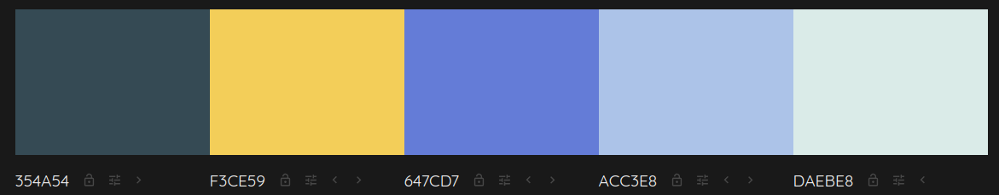
<!-- 

  -->

#### Typography
The typography pairing used on the site are [Roboto Mono](https://fonts.google.com/specimen/Roboto+Mono?query=roboto+mono) and [Montserrat Alternates](https://fonts.google.com/specimen/Montserrat+Alternates?query=montserrat+alternates) imported from [Google Fonts](https://fonts.google.com/). Fonts Tahoma, Helvetica and sans-serifin are used as backup fonts in case of import failure. Montserrat Alternates is chosen for the titles, headings and copyright section, whilst Roboto Mono is used for the standard text parts, navbar and social network links.

#### Imagery
The selected imagery has been sourced and created from various sites. The Pantheon image is taken from Wikipedia, while the other images are from [Pexels](https://www.pexels.com/) and [Unsplash](https://unsplash.com/). More details can be find in [Credits Media](#media).

[Back to top](#smiling-depression)

## Features 

### Existing Features

- __Navigation Bar__

  - Featured on all four pages, the full responsive navigation bar includes the Logo and links to the Home page, Gallery and Sign Up page and is identical in each page to allow for easy navigation.
  - The logo (upside down smiley) appears on the left side whilst the links to Home, Symptoms, Awareness and Contact. The current page is marked by the underlined style of the link.
  - On hover a small animation of transition appears, the font size of the link tekst increases and an elliptical shape sorrounds it.
  - On smaller screens the logo goes up in the center above the links.

   
  

    
Screenshot

    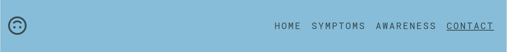
    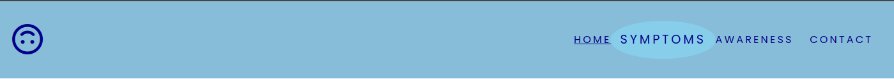
    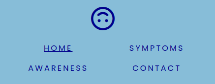
  

   

- __The landing page image__

  - The landing includes a photograph with text overlay to allow the user to see the exact topic of the web site.
  - This section introduces the user to Smiling Depression with an image that powerfully depicts the essence of this condition - a guy's face out of focus in front of which is his smartphone with him smiling.

   
  

    
Screenshot

    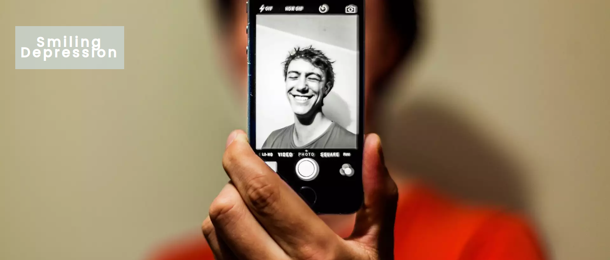
  

   

- __Short Info Section__

  - This section allows the user to grasp the general info about the smiling depression condition.
  - The accompanying images in a circle shaped fashion underline the info text

   
  

    
Screenshot

    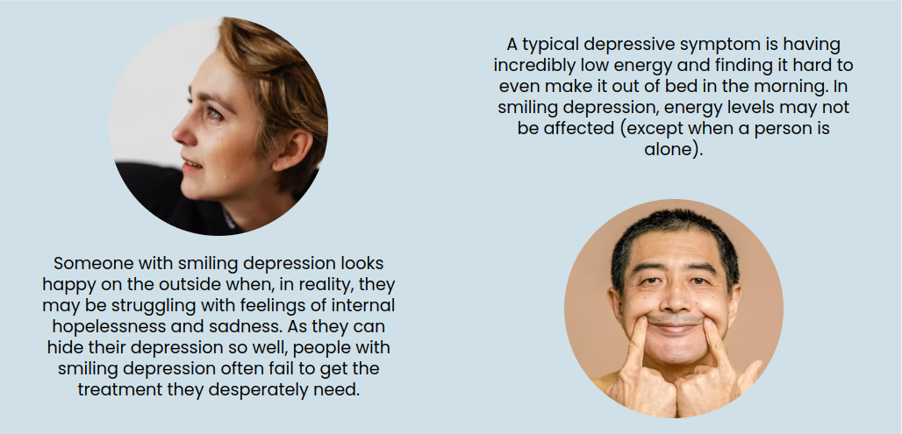
  

   

- __Contact Section__

  - This section section appears every page, except the Contact page to which the Contact Us button is leading on click. 
  - There's an encouraging message 

   
  

    
Screenshot

    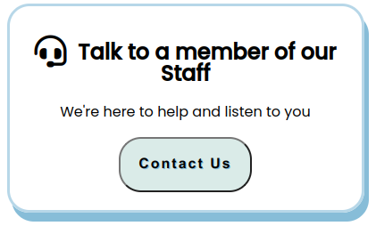
  

   

- __The Address and Map__

  - This section gives the information about the location of the fictitious Institute for Wellbeing in Rome
  - Other than the address, there's an image of the Institute (Pantheon) and below these information there's an interactive Google Map section.

   
  

    
Screenshot

    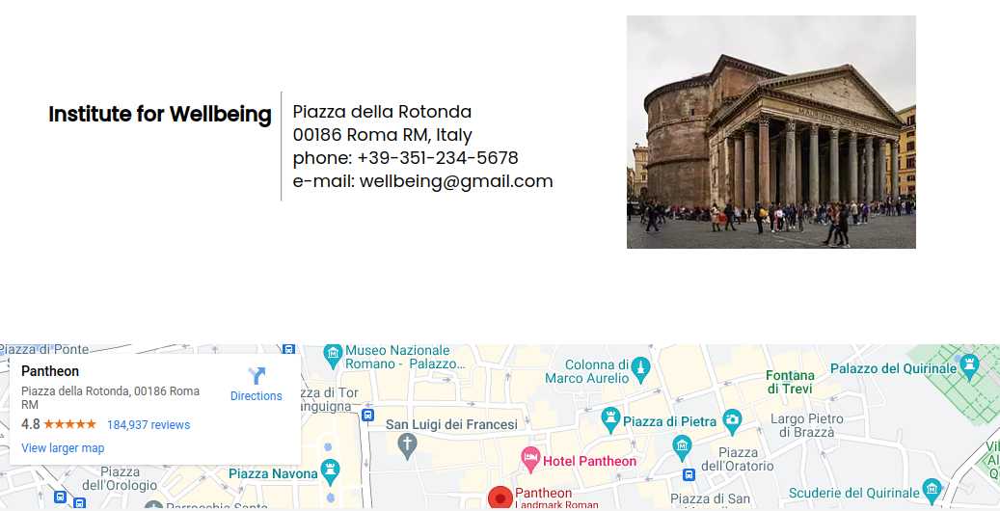
  

   

- __The Footer__ 

  - The footer section includes links to the relevant social media sites of the Institute (actually leading only to the hompegaes of the respective social media sites). The links will open to a new tab to allow easy navigation for the user. 
  - The footer is valuable to the user as it encourages them to keep connected via social media.
  - The FontAwesome icons are used on smaller and middle screens, whilst the text appears on bigger screens.
  - There's a copyright info under the links.

   
  

    
Screenshots

    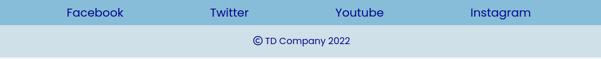
    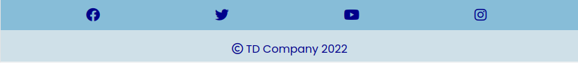
  

  
   

- __Symptoms of Smiling Depression Page__

  - This page main section provides articles about the most common symptoms of smiling depression. There are four articles, each represented by a title, image and a paragraph of text.
  - On bigger screens, paragraph takes 2/3 of the row, whilst image with the title occupies 1/3. Every second article changes the position of the paragraph and image as well as colour. On smaller screens, the image is above the paragraph and both take 100% of the width.
  
   
  

    
Screenshot

    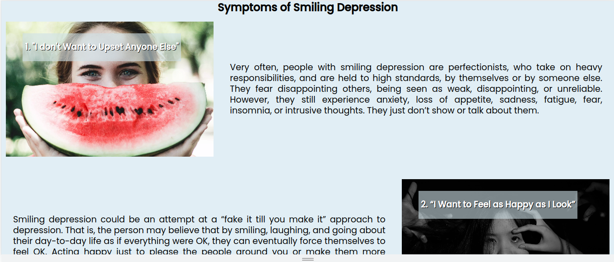
  

   

- __Awareness and Testimonials about Smiling Depression Page__

  - This page has a distinctive video gallery that will provide the user with the YouTube videos about smiling depression. 
  - The organization of the videos is very simple - one video per row on smaller screens in order to make user to concentrate on each story instead of the visual appearence of the gallery. On big screens - the video gallery features two videos per row.

   
  

    
Screenshot

    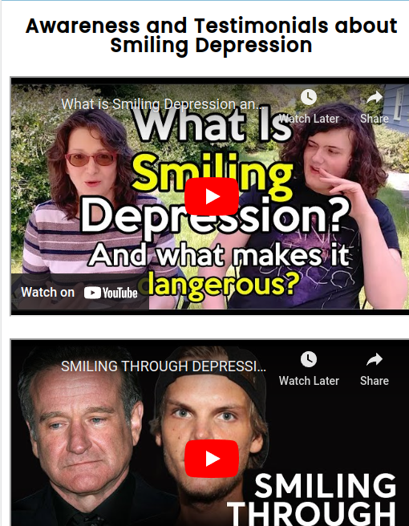
    
  

   

- __Contact Us Page__

  - This page will allow the user to send his minimal details in order to get contacted by the Institute for Wellbeing. The name and email address are requested, whilest the message is optional.
  - On bigger screens an image of a clown-like fake smile person apears to the left side of the form.

   
  

    
Screenshot

    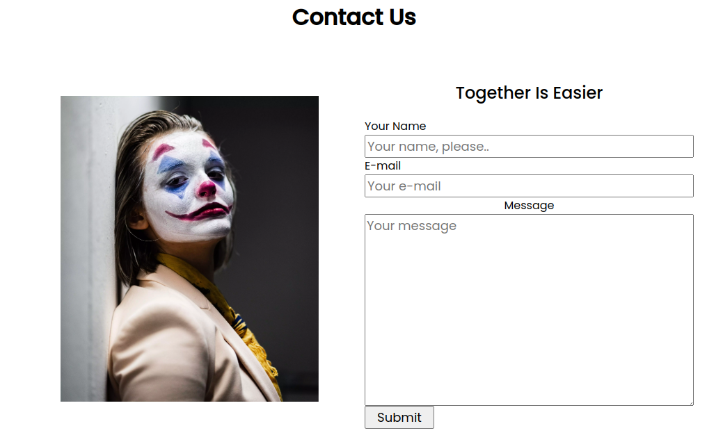
  

   

### Features to Implement

- __Short Testimonials Page__
  - This could be a nice interactive page in where the testimonials of users who visited the page would be presented. The users would be invited to share their experiences about the smiling depression, the Institute of Wellbeing and the website content.

## Issues and Bugs 
The developer ran into several issues during the development of the website, with the noteworthy ones listed below, along with solutions or ideas to implement in the future.
**yet to be added**

### Validator Testing 

- HTML
  - No errors were returned when passing through the official [W3C validator](https://validator.w3.org/nu/?doc=https%3A%2F%2Ftomdu3.github.io%2FCI-project-1%2F)
       
- CSS
  - No errors were found when passing through the official [(Jigsaw) validator](https://jigsaw.w3.org/css-validator/validator?uri=https%3A%2F%2Ftomdu3.github.io%2FCI-project-1%2Fassets%2Fcss%2Fstyle.css&profile=css3svg&usermedium=all&warning=1&vextwarning=&lang=en)
    

      
    

  
## Technologies Used
### Main Languages Used
- [HTML5](https://en.wikipedia.org/wiki/HTML5 "Link to HTML in Wikipedia")
- [CSS3](https://en.wikipedia.org/wiki/Cascading_Style_Sheets "Link to CSS in Wikipedia")

### Frameworks, Libraries & Programs Used
- [Codepen](https://codepen.io/)
  - Codepen website was used abundantly as a playground for the developer to experiment with the code and styles before implementing the desired code into the project.
- [Colormind](http://colormind.io/)
  - Colormind was used to generate the colour palette.
- [Google Fonts](https://fonts.google.com/ "Link to Google Fonts")
    - Google fonts was used to import the fonts *Montserrat Alternates*, *Roboto Mono*  and *Zen Antique Sof* into the style.css file. These fonts were used throughout the project.
- [Font Awesome](https://fontawesome.com/ "Link to FontAwesome")
     - Font Awesome was used on almost all pages throughout the website to import icons (e.g. social media icons) for UX purposes.
- [GitPod](https://gitpod.io/ "Link to GitPod")
     - GitPod was used for writing code, git commiting and pushing the code to GitHub.
- [GitHub](https://github.com/ "Link to GitHub")
     - GitHub was used to store the project online.
- [Figma](https://www.figma.com/ "Link to Figma homepage")
     - Figma was used to create the wireframes during the design phase of the project.
- [Am I Responsive?](http://ami.responsivedesign.is/# "Link to Am I Responsive Homepage")
     - Am I Responsive was used in order to see responsive design and to generate mockup imagery to be used in this README file.

[Back to top](#smiling-depression)

## Deployment
- The site was deployed to GitHub pages. The steps to deploy are as follows: 
  - In the GitHub repository, navigate to the **Settings** tab 
  - From the left side menu select **Pages**.
  - From the source section drop-down menu, select the **main** branch and click on **save**.
  - Once the main branch has been selected and saved, the page will be automatically refreshed with a detailed ribbon display to indicate the successful deployment. 

The live link can be found here - https://tomdu3.github.io/CI-project-1/ 

## Testing 

**yet to be added**

## Credits 
### Content 
- Texts are taken and adapted from the sites:
  - [Medical News Today](https://www.medicalnewstoday.com/articles/smiling-depression)
  - [Webmd](https://www.webmd.com/depression/smiling-depression-overview)
  - [Davidson Institute](https://www.davidsongifted.org/gifted-blog/dabrowskis-theory-and-existential-depression-in-gifted-children-and-adults/)

## Code Features
- Fonts used are from [Google Fonts](https://fonts.google.com/)
- The starting colour palette is *Sky Palettes* from [W3Schools](https://www.w3schools.com/colors/colors_palettes.asp)
- The final colour palette was generated by the [Color Mind](http://colormind.io/).
- Navbar was made by following the instructions of [Flexbox Navbar Mobile First Responsive Tutorial](https://youtu.be/yXhfUCXy2j4)
- Google Maps were implemented with the help of [How to embed a Google Map into a web page](https://extension.umaine.edu/plugged-in/technology-marketing-communications/web/tips-for-web-managers/embed-map/)
- Instructions on how to implement form validation on the Contact Us page was taken from the Code Institute Course.
- The icons used on the pages were taken from [Font Awesome](https://fontawesome.com/)

### Media
- The photos used on the home and sign up page are from [Pexels](https://www.pexels.com) and [Unsplash](https://unsplash.com):
  - [Photo by Antoine Beauvillain](https://unsplash.com/@antoinebeauvillain?utm_source=unsplash&utm_medium=referral&utm_content=creditCopyText)
  - [Photo by Karolina Grabowska from Pexels](https://www.pexels.com/photo/photo-of-person-crying-4472021/)
  - [Photo by Ketut Subiyanto from Pexels](https://www.pexels.com/photo/man-in-yellow-crew-neck-t-shirt-forcing-a-smiley-look-4584534/)
  - [Photo by Yan Krukov](https://www.pexels.com/photo/a-woman-need-help-7640764/)
  - [Photo by Caju Gomes](https://unsplash.com/photos/QDq3YliZg48?utm_source=unsplash&utm_medium=referral&utm_content=creditShareLink)
  - [Photo by Nicholas Kusuma](https://unsplash.com/photos/xb2DaEeX8jk?utm_source=unsplash&utm_medium=referral&utm_content=creditShareLink)
  - [Photo by Khoa Võ](https://www.pexels.com/photo/ethnic-woman-looking-at-fish-in-aquarium-4958618/)
  - [Photo by Pia Kafanke](https://www.pexels.com/photo/woman-with-white-and-red-face-paint-3807702/)
  - [Photo by Gratisography](https://www.pexels.com/photo/man-person-people-emotions-1990/)
- The image of Pantheon was taken from [Wikipaedia Media](https://upload.wikimedia.org/wikipedia/commons/thumb/7/7b/Pantheon_%28Rome%29_-_Right_side_and_front.jpg/298px-Pantheon_%28Rome%29_-_Right_side_and_front.jpg)
- The videos on the Awareness page are taken from [Youtube](https://www.youtube.com):
  - [What is Smiling Depression and What Makes It Dangerous?](https://youtu.be/Mgvd_fZfis0)
  - [Smiling Through Depression?](https://youtu.be/Kx3dpO6ys5s)
  - [This is what smiling depression looks like Slay Motivation](https://www.youtube.com/shorts/q5sSXJSVOn4)
  - [Smiling Depression Short film](https://www.youtube.com/watch?v=mSq4NlCg3u8)
  - [UNSPOKEN (2018) - Award Winning Short Film About Depression](https://youtu.be/k269NkuKK7Y)

[Back to top](#smiling-depression)

## Acknowledgements
**yet to be added**

[Back to top](#smiling-depression)
