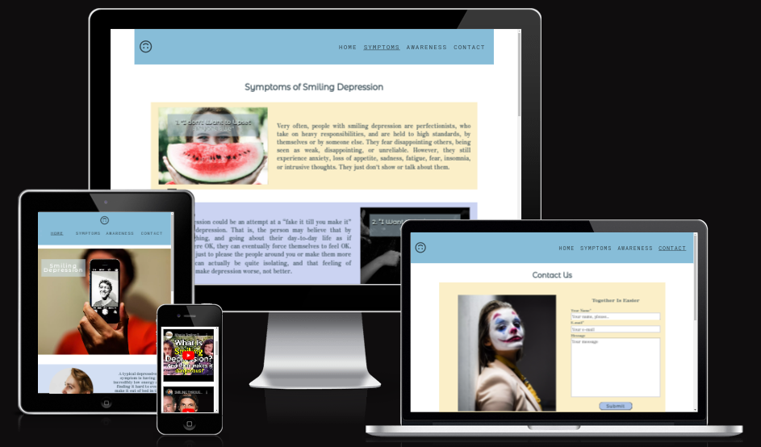
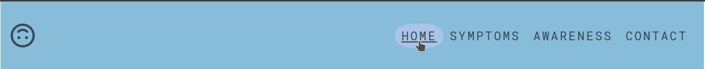
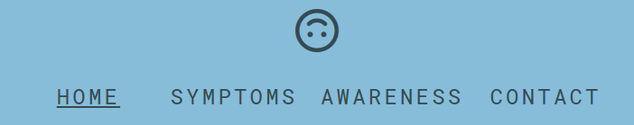

# Smiling Depression

## Site Info

This website has as a main theme the **smiling depression**, a functioning depression condition that is quite spread and many times unobserved. Here the developer wanted to give a first information about this condition and raise awareness about it. The general info is then linked to the fictious Institute of Wellbeing in Rome from which a person can require help or more info.

The targeted users would be:
  * someone who suffers from smiling depression
  * an introvert working in people-centric spaces and environments
  * someone who is close to a person who suffers from smiling depression
  * someone who is responsible for a wellbeing of the persons in a people-centric envrionment

User should be able to:
* easily retrieve the general info about smiling depression
* easily retrieve the info about symptoms of smiling depression
* retrieve info from the video testimonials and depiction of this condition
* easily contact the Institute for Wellbeing in Rome 

In order to provide a website that responds to the above mentioned user stories with the corresponding functionalities, the developer must present the smiling depression as a serious condition, the symptoms, the testimonials of this condition and give the opportunity for the user to require more info or help in that regard.

## Features 
### Existing Features

- __Navigation Bar__

  - Featured on all four pages, the full responsive navigation bar includes the Logo and links to the Home page, Gallery and Sign Up page and is identical in each page to allow for easy navigation.
  - The logo (upside down smiley) appears on the left side whilst the links to Home, Symptoms, Awareness and Contact. The current page is marked by the underlined style of the link.
  - On hover a small animation of transition appears, the font size of the link tekst increases and an elliptical shape sorrounds it.
  - On smaller screens the logo goes up in the center above the links.

   
  

    
Screenshot

    
    
    
  

   

- __The landing page image__

  - The landing includes a photograph with text overlay to allow the user to see the exact topic of the web site.
  - This section introduces the user to Smiling Depression with an image that powerfully depicts the essence of this condition - a guy's face out of focus in front of which is his smartphone with him smiling.

   
  

    
Screenshot

    
  

   

- __Short Info Section__

  - This section allows the user to grasp the general info about the smiling depression condition.
  - The accompanying images in a circle shaped fashion underline the info text

   
  

    
Screenshot

    
  

   

- __Contact Section__

  - This section section appears every page, except the Contact page to which the Contact Us button is leading on click. 
  - There's an encouraging message 

   
  

    
Screenshot

    
  

   

- __The Address and Map__

  - This section gives the information about the location of the fictitious Institute for Wellbeign in Rome
  - Other than the address, there's an image of the Institute (Pantheon) and below these information there's an interactive Google Map section.

   
  

    
Screenshot

    
  

   

- __The Footer__ 

  - The footer section includes links to the relevant social media sites of the Institute (actually leading only to the hompegaes of the respective social media sites). The links will open to a new tab to allow easy navigation for the user. 
  - The footer is valuable to the user as it encourages them to keep connected via social media.
  - The FontAwesome icons are used on smaller and middle screens, whilst the text appears on bigger screens.
  - There's a copyright info under the links.

   
  

    
Screenshots

    
    
  

  
   

- __Symptoms of Smiling Depression Page__

  - This page main section provides articles about the most common symptoms of smiling depression. There are four articles, each represented by a title, image and a paragraph of text.
  - On bigger screens, paragraph takes 2/3 of the row, whilst image with title occupies 1/3. Every second article changes the position of the paragraph and image. On smaller screens, the image is above the paragraph and both take 100% of the width.
  
   
  

    
Screenshot

    
  

   

- __Awareness and Testimonials about Smiling Depression Page__

  - This page has a distinctive video gallery that will provide the user with the YouTube videos about smiling depression. 
  - The organization of the videos is very simple - one video per row in order to make user to concentrate on each story instead of the visual appearence of the gallery. 

   
  

    
Screenshot

    
  

   

- __Contact Us Page__

  - This page will allow the user to send his minimal details in order to get contacted by the Institute for Wellbeign.
  - On middle sized and bigger screens, an image of a clown-like fake smile person apears on the left size of the form.

   
  

    
Screenshot

    
  

   

### Features to Implement

- __Short Testimonials Page__
  - This could be a nice interactive page in where the testimonials of users who visited the page would be presented. The users would be invited to share their experiences about the smiling depression, the Institute of Wellbeing and the website content.

## Testing 

**yet to add**

### Validator Testing 

- HTML
  - No errors were returned when passing through the official [W3C validator](https://validator.w3.org/nu/?doc=https%3A%2F%2Ftomdu3.github.io%2FCI-project-1%2F)
       
- CSS
  - No errors were found when passing through the official [(Jigsaw) validator](https://jigsaw.w3.org/css-validator/validator?uri=https%3A%2F%2Ftomdu3.github.io%2FCI-project-1%2Fassets%2Fcss%2Fstyle.css&profile=css3svg&usermedium=all&warning=1&vextwarning=&lang=en)
    

      
    

### Unfixed Bugs

**yet to add**

## Deployment

- The site was deployed to GitHub pages. The steps to deploy are as follows: 
  - In the GitHub repository, navigate to the **Settings** tab 
  - From the left side menu select **Pages**.
  - From the source section drop-down menu, select the **main** branch and click on **save**.
  - Once the main branch has been selected and saved, the page will be automatically refreshed with a detailed ribbon display to indicate the successful deployment. 

The live link can be found here - https://tomdu3.github.io/CI-project-1/ 

## Credits 

### Content 

- Navbar was made by following the instructions of [Flexbox Navbar Mobile First Responsive Tutorial](https://youtu.be/yXhfUCXy2j4)
- Google Maps were implemented with the help of [How to embed a Google Map into a web page](https://extension.umaine.edu/plugged-in/technology-marketing-communications/web/tips-for-web-managers/embed-map/)
- Instructions on how to implement form validation on the Contact Us page was taken from the Code Institute Course.
- The icons used on the pages were taken from [Font Awesome](https://fontawesome.com/)

### Media

- The photos used on the home and sign up page are from [Pexels](https://www.pexels.com) and [Unsplash](https://unsplash.com)
- The image of Panhteon was taken from the [Wikipaedia Media](https://upload.wikimedia.org/wikipedia/commons/thumb/7/7b/Pantheon_%28Rome%29_-_Right_side_and_front.jpg/298px-Pantheon_%28Rome%29_-_Right_side_and_front.jpg)
- The videos on the Awareness page are taken from [Youtube](https://www.youtube.com)